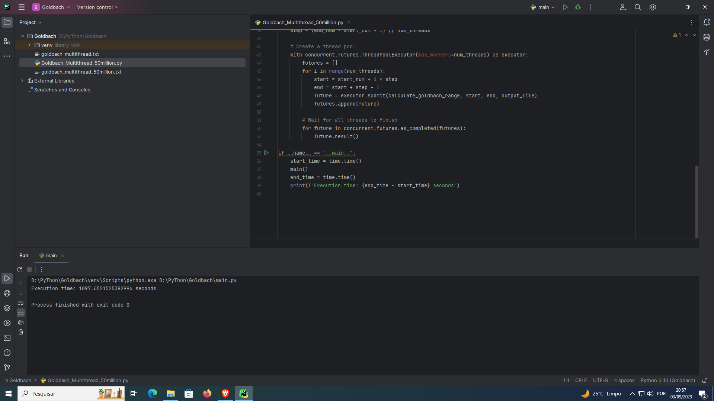

# Goldbach Conjecture

## Introduction

The Goldbach Conjecture is one of the oldest unsolved problems in number theory. It is named after the German mathematician Christian Goldbach, who first stated it in a letter to Euler in 1742. The conjecture posits that every even integer greater than 2 can be expressed as the sum of two prime numbers. In other words, for every even number "n," there exist prime numbers "p" and "q" such that "n = p + q."

The conjecture has intrigued mathematicians for centuries and has remained unsolved despite extensive efforts to prove or disprove it. Although it is a deceptively simple statement, it touches upon fundamental questions in number theory and the distribution of prime numbers. As of my last knowledge update in September 2021, the conjecture has not been definitively proven or disproven, making it one of the most famous unsolved problems in mathematics.

## Problem Statement

Formally, the Goldbach Conjecture can be expressed as follows:

**Conjecture:** Every even integer greater than 2 can be expressed as the sum of two prime numbers.

In mathematical notation, this can be represented as:

For every even integer "n" (where n > 2), there exist prime numbers "p" and "q" such that:

n = p + q

The conjecture suggests that this property holds true for all even numbers, and it has been tested extensively for large even integers. However, a formal proof that demonstrates this for all even numbers remains elusive.

## Historical Background

The Goldbach Conjecture was first proposed by Christian Goldbach in a letter to the renowned Swiss mathematician Leonhard Euler in 1742. Goldbach's original statement of the conjecture was in the form of a letter, which read:

"I have found that every integer greater than 2 is either a prime or can be written as the sum of two primes."

Euler's response to Goldbach's letter included a postscript in which he stated that he considered the conjecture "above all other theorems" and believed it to be true. Euler's support of the conjecture added to its significance and prominence in the mathematical community.

## Challenges and Significance

The Goldbach Conjecture has proven to be a remarkably resilient problem, resisting countless attempts at proof over the centuries. Several factors contribute to the difficulty of proving or disproving the conjecture:

### 1. Vastness of the Problem Space

The conjecture applies to all even integers greater than 2, which encompasses an infinitely large set of numbers. Proving a statement for an infinite set is a formidable task in mathematics.

### 2. The Nature of Prime Numbers

The conjecture relies on the properties of prime numbers, which are themselves a subject of great mathematical interest and complexity. Prime numbers do not follow a simple pattern, and their distribution is irregular, making it challenging to predict their behavior.

### 3. Computational Complexity

While the conjecture has been verified for a vast range of even numbers through computational methods, a formal proof requires establishing the existence of prime pairs for all even numbers theoretically. This is computationally infeasible for larger numbers.

### 4. Lack of Counterexamples

Despite extensive testing and verification, no counterexamples to the conjecture have been found. Every even number tested so far has been expressible as the sum of two primes.

The Goldbach Conjecture remains an important problem in number theory due to its simplicity and the deep questions it raises about prime numbers. Additionally, its proof or disproof could have implications for the broader understanding of number theory.

## Progress and Contributions

Since its formulation, the Goldbach Conjecture has inspired numerous mathematicians to investigate its validity. While no complete proof has been discovered, there have been several important contributions and results related to the conjecture:

1. **Empirical Verification:** The conjecture has been tested extensively for large even numbers using computer algorithms, and it holds true for an enormous range of cases. However, empirical evidence alone does not constitute a formal proof.

2. **Partial Results:** Mathematicians have made progress by proving variations and special cases of the conjecture. Notable results include Vinogradov's Theorem and Hardy and Littlewood's result on the existence of infinitely many Goldbach partitions.

3. **Computational Efforts:** Modern computational tools and distributed computing projects have extended the verification of the conjecture to ever-larger numbers, pushing the boundaries of computational mathematics.

4. **Ongoing Research:** The conjecture continues to be an active area of research, with mathematicians exploring new techniques and approaches to address it. Efforts are ongoing to develop methods that might lead to a formal proof or disproof.

## Conclusion

The Goldbach Conjecture, proposed over two centuries ago, remains one of the most tantalizing unsolved problems in mathematics. Its simplicity and elegance belie the complexity of the questions it poses about prime numbers and the fundamental nature of arithmetic.

While extensive computational verification suggests the conjecture is likely true, the lack of a formal proof means that the conjecture retains its status as an open problem, captivating the minds of mathematicians and enthusiasts alike. Its resolution, whether in the form of a proof or counterexample, would undoubtedly be a significant milestone in the field of number theory and mathematics as a whole.
Certainly! Here's an explanation of the algorithm used in the Goldbach Conjecture computation and how multi-threading is employed to enhance its performance.

## Goldbach Conjecture Algorithm

The Goldbach Conjecture is an unsolved problem in number theory that revolves around expressing even integers greater than 2 as the sum of two prime numbers. The algorithm to explore this conjecture generally follows these steps:

1. **Iterate through Even Numbers**: Start with an even number "n" greater than 2. For each "n," check if it can be expressed as the sum of two prime numbers "p" and "q."

2. **Prime Number Testing**: For each candidate prime "p," check if it is a prime number. This involves verifying that "p" is not divisible by any integer other than 1 and itself. If "p" is prime, proceed to the next step.

3. **Complement Testing**: Once a prime "p" is found, check if its complement "q" (i.e., "n - p") is also prime. If "q" is prime, you've found a Goldbach partition for "n."

4. **Repeat**: Continue iterating through even numbers and repeating the above steps until you've explored the desired range.

The algorithm relies on two key components: prime number testing and complement testing. Prime number testing involves checking if a number is prime, which can be done using various primality testing methods such as the Miller-Rabin primality test. Complement testing verifies if the complement of a prime number is also prime, ensuring that the sum of the two primes is indeed equal to the even number "n."

## Multi-Threading Technique

Multi-threading is a parallel computing technique used to improve the efficiency of computations by dividing tasks into multiple threads or concurrent processes. In the context of the Goldbach Conjecture computation, multi-threading can be employed to enhance performance in the following manner:

### 1. Range Splitting:

The range of even numbers to be tested for Goldbach partitions can be divided into smaller subranges. Each subrange can then be assigned to a separate thread for concurrent processing. For example, if you want to test even numbers from 2 to 10 million, you can split the range into smaller segments, and each thread can work on a different segment of numbers.

### 2. Parallel Prime Testing:

Prime number testing is a computationally intensive task. Each thread can independently test whether a number is prime or not using methods like the Miller-Rabin primality test. This parallelism allows multiple numbers to be tested for primality simultaneously, speeding up the overall computation.

### 3. Complement Calculation:

Once a prime number is identified, each thread can concurrently calculate its complement and check if the complement is also prime. This step can be done in parallel for multiple candidate primes.

### 4. Efficient Resource Utilization:

Multi-threading helps in making efficient use of available CPU cores or computing resources. By utilizing multiple threads, the computation can be distributed across cores, potentially reducing the time required to explore a large range of even numbers.

### 5. Thread Synchronization:

In multi-threaded programs, it's essential to implement proper thread synchronization mechanisms to prevent race conditions and ensure correct results. For example, when writing the results to a file, threads may need to coordinate to avoid conflicts.

Overall, multi-threading can significantly accelerate the Goldbach Conjecture computation by allowing multiple numbers to be tested concurrently for Goldbach partitions. However, it's important to consider hardware limitations and resource constraints when determining the optimal number of threads to use and the range of numbers to explore. Additionally, effective parallelization may require careful design and synchronization to avoid issues such as data races and ensure accurate results.

50 millions in 1097s using Multi-thread.
